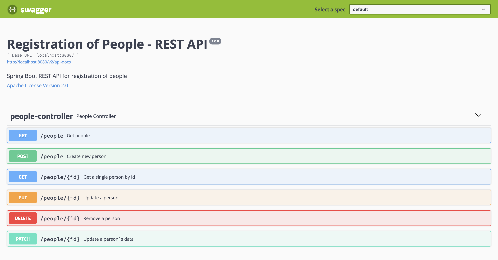

# Registration of People - API

The purpose of this project is to be used as a basis for automated API testing projects.

## Language and frameworks
   
- Java 13
- Maven
- Spring Boot
- Lombok
- Swagger

## Command line execution

To start the API it is necessary to execute the command:

```shell script
mvn spring-boot:run
```

## Swagger

The API documentation can be found at the link <http://localhost:8080/swagger-ui.html#/>




## Links

- [Registration of People - Client](https://github.com/Matheeusb/registration-people-api-client)
- [Registration of People - Test](https://github.com/Matheeusb/registration-people-api-test)